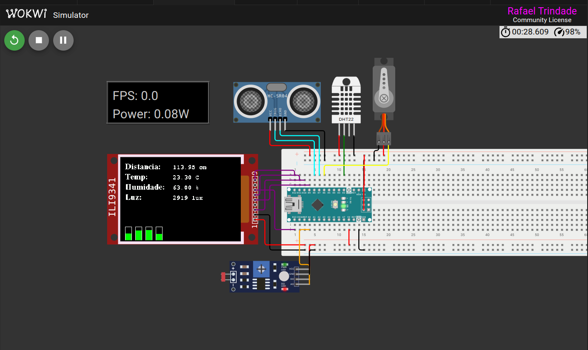

# Smart Garden Project Description

## Project Name: Smart Garden

#### [Click here to visit the Smart Garden project on Wokwi](https://wokwi.com/projects/398913098629206017 "Visit the Smart Garden project on Wokwi")

### Project Overview:
The Smart Garden project aims to create a self-sustaining and automated gardening system that monitors and optimizes plant growth conditions. This system utilizes various sensors and actuators to provide real-time data and control over environmental factors such as temperature, humidity, light intensity, and soil moisture.

``v1``
### Project Components:
- Arduino Nano microcontroller: Controls the system and interacts with the sensors and actuators.
- DHT22 sensor: Measures temperature and humidity.
- Ultrasonic sensor: Measures distance to the plant or soil surface.
- Photoresistor sensor: Measures light intensity.
- ILI9341 LCD screen: Displays sensor readings and system status.
- Water pump: Provides water to the plants.
- LED grow light: Provides supplemental lighting.
- Soil moisture sensor: Measures the moisture level in the soil.

### Project Functionality:
- Data Acquisition: Sensors continuously collect data on environmental factors and plant growth conditions.
- Data Visualization: Sensor readings are displayed on the LCD screen in real-time.
- Automated Control: The system adjusts the water pump and LED grow light based on sensor readings to maintain optimal conditions for plant growth.
- User Interface: The LCD screen provides a user interface for monitoring the system and adjusting settings.

### Project Benefits:
- Increased Plant Growth: Optimizes environmental conditions for plant growth, leading to increased yields and healthier plants.
- Reduced Water Consumption: Automated watering system ensures plants receive the right amount of water, reducing waste.
- Reduced Maintenance: Automates tasks such as watering and lighting, reducing manual intervention.
- Real-Time Monitoring: The LCD screen provides real-time data on plant growth conditions, allowing for proactive adjustments.

### Project Applications:
- Home gardening: Allows the growth of herbs, vegetables, and flowers in a home environment.
- Commercial agriculture: Can be scaled up for use in commercial greenhouses and farms.
- Educational purposes: Can be used to teach students about plant science and technology.

### Project Future Development:
- Integration with mobile app: Develop a mobile app to remotely monitor and control the system.
- Machine learning: Implement machine learning algorithms to optimize plant growth conditions based on historical data.
- Expansion of sensor capabilities: Add additional sensors to monitor other environmental factors such as CO2 levels and soil nutrients.

### Project Conclusion:
The Smart Garden project is a promising solution for creating a self-sustaining and automated gardening system that promotes plant growth and reduces resource consumption. By utilizing sensors, actuators, and a user-friendly interface, the